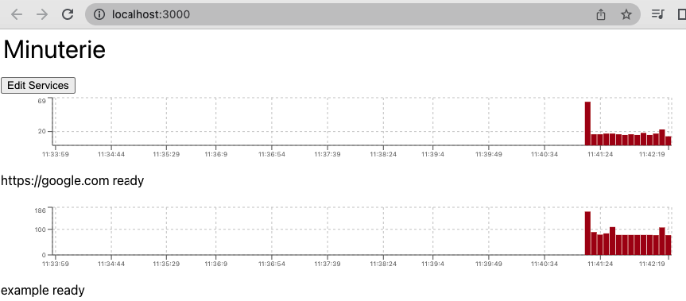

# minuterie

standalone react web app dashboard with charts for checking service uptime downtime availability

This project was bootstrapped with [Create React App](https://github.com/facebook/create-react-app).

```sh
npm i
npm run build
npm run start
```

Sample configuration:

```yaml
services:

# most basic service
- "https://google.com"

# detailed service definition
- name: example
  type: http
  method: get
  headers:
    x-my-header: my-value
  url: http://example.com
  every: 5s
```

Example app:


